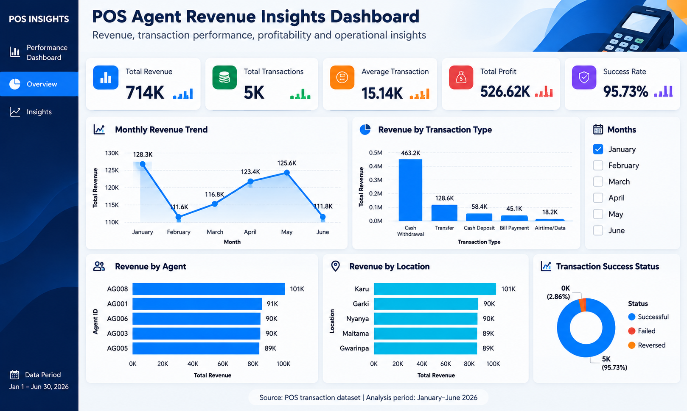

# POS Agent Revenue Insights Dashboard

An interactive Power BI dashboard that analyzes revenue, profitability, transaction outcomes, agent performance, location performance and monthly trends for a POS agent network, built on a synthetic dataset.

**[View the live interactive dashboard](https://app.powerbi.com/view?r=eyJrIjoiYmI3ZDZkYzktYmIzNy00Nzk0LWE5ZmEtNDU1OWJjOGE5MmVkIiwidCI6Ijk4NThlNmNkLTZiZTgtNDIxYi05ZTQ4LTJhOGEyNmZlNDgwMCJ9)** | **[Read the case study](https://george-234.github.io/pos-revenue-dashboard/)**

## Headline Results

| Metric | Value |
|---|---|
| Total revenue | ₦714K |
| Total profit | ₦526.62K (about 74% of revenue) |
| Total transactions | 5,000 |
| Transaction success rate | 95.73% |
| Period | January to June 2026 |

## Business Problem

A POS agent network needs visibility into where revenue comes from, how reliable its transactions are, which agents and locations contribute most, and how revenue changes over time.

**Objective:** build an interactive management dashboard that brings these indicators together and highlights areas that need further investigation.

## Dataset

| Item | Detail |
|---|---|
| Type | Synthetic (no real customer or agent information) |
| Period | January to June 2026 |
| Transactions | 5,000 |
| Dimensions | Agents, locations, transaction types, transaction outcomes |
| How it was generated | Generated with an AI tool |

## Dashboard Structure

**Overview page**
- KPI cards: revenue, profit, transactions, average transaction, success rate
- Monthly revenue trend
- Revenue by transaction type, agent and location
- Transaction success status
- Month slicer

**Insights page**
- Key findings
- Areas requiring investigation
- Business recommendations

## Key Findings

1. **Strong revenue and margin.** About ₦714K in revenue and ₦526.62K in profit across 5,000 transactions.
2. **Reliable transactions.** The success rate is 95.73%.
3. **Cash Withdrawal drives revenue.** It is the largest revenue contributor among the transaction types analyzed, while Bill Payment and Airtime/Data contribute little.
4. **Agent performance varies.** AG008 leads at about ₦101K, roughly 13% above the fifth-ranked agent shown (AG005, about ₦89K).
5. **Location performance varies.** Karu leads at about ₦101K, ahead of Gwarinpa at about ₦89K.
6. **June decline.** Revenue recovered from a February low to a May high, then fell about 11% in June.

## Recommendations

1. Investigate the drivers of the June revenue decline.
2. Study AG008's activity for practices other agents can repeat.
3. Investigate lower-performing locations for opportunities to increase activity.
4. Grow Bill Payment and Airtime/Data to reduce reliance on Cash Withdrawal.

## Analytical Limitations

- The dataset is synthetic, so findings illustrate the analysis approach rather than a real network.
- The analysis covers six months only.
- The June decline is flagged for investigation. The data does not establish its cause.
- Agent and location charts show the top five entries only.

## Repository Contents

| File | Purpose |
|---|---|
| `README.md` | Project overview |
| `pos-agent-revenue-dashboard.png` | Dashboard screenshot |
| `POS_Agent_Revenue_Dashboard.pbix` | Power BI source file |
| `index.html` | Case-study page with the embedded dashboard (GitHub Pages) |

## Tools and Skills

**Tools:** Power BI Desktop, Power BI Service, Power Query, DAX

**Skills demonstrated:** data visualization, KPI development, business analysis, trend analysis, operational reporting, dashboard design, data storytelling

## Author

**George Adeh**

- LinkedIn: [linkedin.com/in/georgeadeh](https://linkedin.com/in/georgeadeh)
- GitHub: [george-234](https://github.com/george-234)
